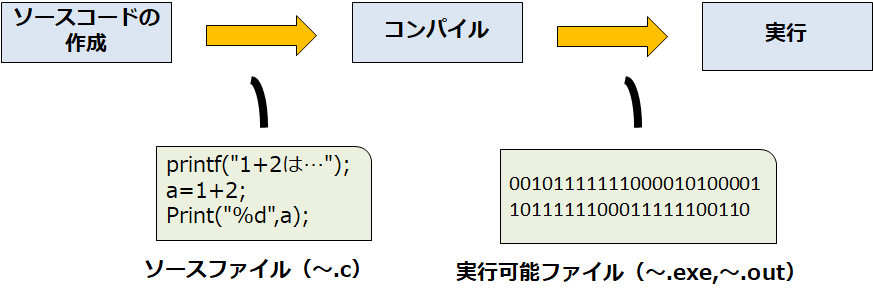
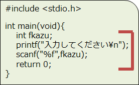
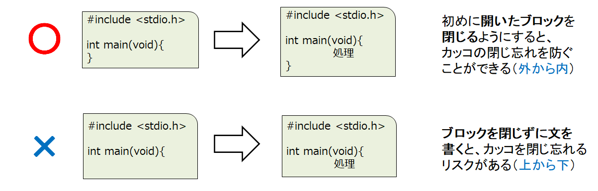
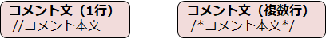

# C言語　第0回　
第0回では、C言語の環境設定を行うとともに、C言語の基礎知識について学んでいきましょう。  

  - [プログラミング言語とは](#プログラミング言語とは)
  - [C言語とは](#c言語とは)
  - [開発環境の整備](#開発環境の整備)
  - [C言語の基礎知識](#c言語の基礎知識)
    - [開発の流れ](#開発の流れ)
      - [ソースコードの作成](#ソースコードの作成)
      - [コンパイル](#コンパイル)
      - [実行](#実行)
    - [プログラムの書き方](#プログラムの書き方)
      - [正確に記述する](#正確に記述する)
      - [外から内に書く](#外から内に書く)
      - [読みやすいソースコードを記述する](#読みやすいソースコードを記述する)

## プログラミング言語とは
コンピュータプログラムを記述するための形式言語は**プログラミング言語**と呼ばれます。  
`例： HTML , CSS , JavaScript , Ruby , Java , PHP , Python など`  
マイナーなものまで合わせると200種類以上あります。   

プログラミング言語を使用することで、Webサイトやアプリケーション、システムを作ることができるようになります。
 
## C言語とは
**C言語**とは、プログラムを作るために利用するプログラミング言語の1つです。  以下のような特徴があります。  
  - 基本文法が標準的で学びやすい。
  - CPUやメモリを自由自在に制御できる。
  - PC以外の家電や機器の制御にも用いることができる。
  - コンピュータやプログラムの仕組みを深く学べる。

C言語を学ぶことで、多種多様なアプリを作成することができます。  `例：WEBアプリ・スマホアプリ・ロボット制御アプリなど`

## 開発環境の整備
以下のURLを参考に、環境を構築しましょう（以下、これを**VSCode**と呼ぶ）。  

  ＜Windows＞ [Visual Studio CodeでC言語プログラミングを始める（Windows編）](https://bit.ly/3hw41up)  
  ＜Mac＞ [MacOSでVisual Studio Codeをインストールする手順](https://qiita.com/watamura/items/51c70fbb848e5f956fd6)   
（拡張機能についてはWindows編のサイトを参照してください）

## C言語の基礎知識
以下の内容は、C言語の基礎知識と基本構造です。  
いますぐ覚える必要は全くありません。ゆっくり覚えていきましょう。
  
### 開発の流れ

#### ソースコードの作成  

最初に、C言語の文法に基づいてコンピュータへの命令を記述し、人間が読んで意味の分かる状態のプログラムを組みます。  
このプログラムを**ソースコード**（又は単に**ソース**や**コード**）といいます。  
そして、記述したソースコードをファイルとしてコンピュータに保存します。  これを**ソースファイル**といいます。  

＜C言語のソースファイル名＞   
①ファイルの拡張子は必ず「**～.c**」とする  
②漢字やひらがなを使うとトラブルの原因になる可能性があるため、**半角の英数字**を使うことが望ましい

#### コンパイル
コンピュータの心臓部であるCPUは、**マシン語**と呼ばれる言語で書かれたプログラムしか実行できません。  
そのため、ソースファイルとして保存しただけでは、プログラムを動作させることができません。  

そこで開発者は、**コンパイラ**と呼ばれるツールを用いて、ソースファイルの内容をマシン語のプログラムに変換します。  
この変換作業は**コンパイル**と呼ばれます。実際の変換の過程は以下の通りです。  

　①コンパイラがソースコードの文法チェックを行う   
　②誤記があれば警告やエラーが表示   
　③チェックを通過すると、マシン語で書かれた実行可能ファイルが生成   
　（VSCodeであれば「~.exe」がファイル名の最後となっているはず）

#### 実行
ファイルの実行が指示されると、OSは実行可能ファイルに書かれているマシン語を取り出してCPUに送ります。  
CPUが届いたマシン語の命令に従い、計算や結果の表示などを実行します。

**VSCodeであれば、コンパイルと実行を再生ボタン1つで済ますことができます**

文字でコンピュータに様々な指示をする画面は、**コマンドプロンプト**や**ターミナル**と呼ばれます。  
実際の実行までの手順（**VSCodeではない場合**）は以下の通りです    

①コンパイルのコマンドとコンパイルするファイル名を入力する（**コンパイル**）  
②コマンドプロンプト等からファイル名を入力（**実行**）

### プログラムの書き方

C言語のソースコードには、**{}**（波カッコ）で囲まれた部分がたくさん登場します。  
この部分を**ブロック**と呼び、コンピュータに対する指示や命令を記述します。

#### 正確に記述する

間違った文字を入力するとプログラムは正常に動きません。以下の点に注意しましょう。

①英数字は基本的に半角で入力し、大文字/小文字の違いも意識する  
②「**;**」(**セミコロン**)と「**:**」(**コロン**)、「**.**」（**ピリオド**）と「**,**」（**カンマ**）を正確に入力する  
③「**()**」、「**{}**」、「**[]**」などのカッコや、「**'**」と「**"**」の引用符の種類を間違えない  

#### ○int main
計算は表示などの命令を書いていく場所は、ブロックの内側です。この部分は**main関数**ともいわれます。  
・main関数の中には、**文**を処理させる順に書いていく。  
・文末には必ず「**;**」(**セミコロン**)をつけるのがC言語のルール。  
・最終文に「**return 0;**」と書く。システムにプログラムが正常に終了したことを知らせる。  

#### 外から内に書く
ブロックの「**{** 」と「**}**」の対応が正しくないというエラーは、初めのうち特に起こりやすいです。  
以下の例を見て、正しいソースコードを書く癖をつける必要があります。

 
#### 読みやすいソースコードを記述する

誰が見ても分かりやすいソースコードを記述することは、今後も必要です。  
**インデント**と**コメント**を活用することで、読みやすいコードになります。  

##### ○インデント　　

C言語では、基本的に、ソースコードのどこに改行・空白を入れてもコンパイルは成功します。  
しかし、見やすさのためには、適切な場所に改行や空白を入れるようにするべきです。

特に、ブロックの開始と終了では正確に**字下げ**（**インデント**）を行い、  
カッコの対応とブロック構造の見通しをよくすることがポイントです。

 

##### ○コメント
プログラムをより読みやすくするため、ソースコードの中に解説文を書き加えることができます。  
この解説文を**コメント**といい、動作には全く影響しません。

