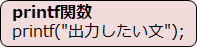

# C言語　第1回　
第1回では、printf関数を学んで何かを出力してみましょう。
そして、演算子について理解しましょう。  
  
  - [printf関数](#printf関数)
  - [算術演算子](#算術演算子)
  
  ---------------------------------------
  
## printf関数 
画面に文字を表示する、最も基本的な命令が**printf関数**です。  


  
この関数は、使うだけで1つで文字列から数値まであらゆるデータを書式化して表示することができる、多機能な関数です。

``` C
#include <stdio.h>

int main(void){
   printf("おはよう!");
   return 0;
}
```
  
上のコードを書いて、実行してみましょう。
`おはよう!`と表示することができたら成功です。

``` C
#include <stdio.h>

int main(void){
   printf("おはよう\nこんにちは");
   return 0;
}
```

このプログラムの実行結果は次の通りになります。
表示されていない「**\n**」は**改行**を表しています。
```
おはよう
こんにちは
```

## 算術演算子
プログラミングは、演算の使用頻度が高いです。
基本的な演算子は下の通りです。  
|演算子| 例 | 意味 |
|:---:| :---: | :--- |
|+| x+y  |足し算|
|-| x-y |引き算|
|*| x*y |掛け算|
|/ | x/y  |割り算|
|%| x%y | 剰余算  （除算の余り） |
`例：19%5=4（3余り4であるため）`

  以下の2点に注意しましょう。

  ・整数同士の割り算の時は商を計算する（余りは無視して、商は整数値になる）。
  `（例）9/2 → 結果は「4」`

  ・文字列の足し算はできない
  `（例）printf("a"+"b")とは書けない`

-----------------------------------
  第1回の補足資料です。
  なんとなく頭に入れておいてくださいー
  [第1回補足資料](pc_01+.md) 
