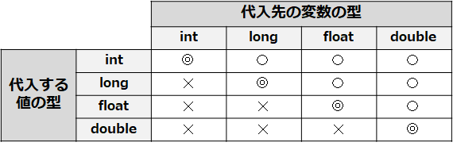
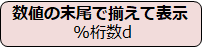
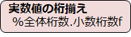

# C言語　第2回補足
自動型変換についてと、数値の桁数の指定について学んでいきましょう。

  - [自動型変換](#自動型変換)
  - [数値の桁数の指定](#数値の桁数の指定)
    - [整数の桁数の指定](#整数の桁数の指定)
    - [実数の桁数の指定](#実数の桁数の指定)
  

## 自動型変換 
あるデータ型で宣言された変数にはその型の値のみを代入できます。  
また、計算による場合でも、左右のオペランドの型が統一されていることが原則です。  
しかしC言語には、自動的に型を変換する仕組みが備わっています。

覚えておくべきデータ型は基本的にはchar型・int型・float型の3つですが、  
ここでは使う可能性のある数値のデータ型をもう少し紹介します。

**※double型はfloat型より使うことを推奨している書籍もあるくらいです。以下のサイト等を参考に、勉強するのもアリでしょう。**  
 [double型における%fと%lfの使い分け](https://algorithm.joho.info/programming/c-language/double-f-lf-printf-scanf/)  

|変換指定子|対応する型|説明|バイト長|保存できる数値の範囲|
|:---:| :---: | :---: | :---: | :---: |
|%d|int|整数|4|-2147483648 〜 2147483647|
|%d|long|整数|8|-9223372036854775808 〜 9223372036854775807|
|%f|float|実数|4|1.17549e-38～ 3.40282e+38|
|%f|double|実数|8|2.22507e-308～1.79769e+308|

---
数値型には以下に示すような大小関係が存在します。
### int型 < long型 < float型 < double型

#### ○代入
数値型の大小関係において、小さな型の値を大きな型の変数に代入する場合に限って、**値が自動的に変数の型に変換**されます。



以下の例では、float型の変数にint型の値を代入していますが、自動的にfloat型に変換されてから代入されています。  
`float f = 3;`

大きな型の値を小さな型の変数に代入することは大変危険です。  
以下の例では、int型の変数にfloat型の値を代入していますが、小数点以下の情報が失われてしまいます。  
`int i = 3.8;`

#### ○演算
異なる型で演算を行うと、**より大きな型に統一**されてから演算が行われます。  
以下の例では、`5`(int型)を`5.0`(float型)に変換してから演算が行われます。    
`float f = 3.8 * 5;`

## 数値の桁数の指定
### 整数の桁数の指定
  
printf関数では、表示する文字や数値の**桁数を指定**できます。  
次のコードは、これまでのように桁数の指定などはなく、そのまま表示したプログラムの例です。
``` C
#include <stdio.h>

int main(void){
   int a = 2023, b = 223, c = 1;

   printf("Aは %d です。\n", a);
   printf("Bは %d です。\n", b);
   printf("Cは %d です。\n", c);

   return 0;
}
```
このプログラムの実行結果は次の通りになります。
``` C
Aは 2023 です。
Bは 223 です。
Cは 1 です。
```
数字がそのまま表示されており、他の数字との位置関係がズレてしまいます。

printf関数で、数値の先頭に空白を入れて、数値の末尾で揃えて表示するには、以下のようにします。



次のプログラムは、桁数を4桁に指定して読みやすくした例です。

``` C
#include <stdio.h>

int main(void){
   int a = 2023, b = 223, c = 1;

   printf("Aは %4d です。\n", a);
   printf("Bは %4d です。\n", b);
   printf("Cは %4d です。\n", c);

   return 0;
}
```
このプログラムの実行結果は次の通りになります。
``` C
Aは 2023 です。
Bは　223 です。
Cは　　1 です。
```

桁数に合わせて空白がいれられて読みやすくなっています。  
なお、指定した桁数よりも数値の桁数の方が大きい場合には、数値の桁数に合わせます。

また、マイナス値を表示すると、「-」 記号も1桁として取り扱われるので、  
マイナスの値を表示する可能性がある場合は**1桁大きく指定**しておきます。
  
### 実数の桁数の指定
実数値の表示では、全体の桁数と共に小数点以下の桁数を指定できます。



ここで注意すべきことは、全体桁数は**小数の桁数**と**小数点**を含むことです。  
例えば、`%6.2f` では、整数部分が3桁、小数点が1桁、小数部分が2桁の6桁と解釈されます。

次のプログラムは、実数値を桁指定で表示するプログラムの例です。
``` C
#include <stdio.h>

int main(void){
   double pi = 3.14159;
   printf("%6.2f\n",pi);
   printf("123456\n");
    
   return 0;
}
```

このプログラムの実行結果は次の通りになります。
``` C
3.14
123456
```

下の行は桁数を見やすくするために付けたものです。全体が6桁、小数点が1桁、小数部分が2桁で表示されていることがわかります。  
なお、小数点以下の桁数を０にすれば、小数点も表示されません。

この項は[このサイト](https://9cguide.appspot.com/05-04.html)を完全に参考しました。  
もう少し細かいことが書かれていますので、興味のある方は是非。
