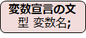
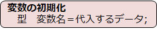
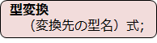
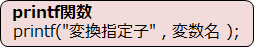

# C言語　第2回　
第2回では、変数について学び、それを利用して前回登場したprintf関数や、新しく登場するscanf関数について学びます。
     
  - [変数](#変数)  
  - [データ型](#データ型)
  - [printf関数](#printf関数)
  - [scanf関数](#scanf関数)
  - [電卓プログラム](#電卓プログラム)

------------------------------------
  
## 変数 
**変数**とは、データを格納するためにコンピュータ内部に準備する箱のようなものです。  
プログラムが扱う数値や文字などの情報を、この箱に納めたり取り出したりしながら処理を進めていきます。

``` C
#include <stdio.h>

int main(void){
  int number;
  number=18;
  printf("%d\n",number);
  return 0;
}
```

上のプログラムは、変数`number`に`18`を入れ、それを取り出して画面に表示しています。  
このように、変数に値を入れることを**代入**、取り出すことを**取得**といいます。  
どちらの操作も変数を宣言した後にしかできません。


変数を宣言するときは、次の2つを必ず指定します。　　
#### ・変数名（データを格納する箱の名前）


#### ・型（変数の種類や大きさ）


変数の名前を付けるときは、**一度使用した変数名を使わない**ことを注意して、  
具体的で内容が分かりやすいように意識しましょう。

変数に値が入っていない状態では、正しく処理を行えない可能性があるため、  変数を宣言したらすぐに何らかの値を代入することが大事です。  
このように、変数宣言と値の代入を同時に行うことを**変数の初期化**といいます。  

また、変数には、任意の値を何度でも代入することができます。

## データ型

プログラムで扱うことのできるデータの種類を、**データ型**（または単に**型**）といいます。  
C言語には多くの型が用意されていますが、今は下の3つを覚えておきましょう。  

|変換指定子|対応する型|説明|
|:---:| :---: | :---: |
|%c|char|半角1文字|
|%d|int|整数|
|%f|float|実数|

 整数値と実数値を相互に変換するには、**型変換**を行う必要があります。  
 


※変数kekkaはint型の整数とする  
`kekka = 18 / 5 →　3が変数に代入される `  
`kekka = (float)18/(float)5 → 3.6が変数に代入される  `    
実数値として`18`と`5`を扱うために型変換（型変換を行わないと、結果は`3`になる）

## printf関数
変数内に入っているデータを**printf関数**で出力する形は以下の通りです。



次のコードは、変数`number`に整数値を代入し、年齢を表示するプログラムの例です。

``` C
#include <stdio.h>

int main(void){
  int number = 18;
  printf("年齢は%d歳\n",number);
  return 0;
}
```

このプログラムの実行結果は次の通りになります。
```
年齢は18歳
```  

## scanf関数
  変数には、キーボードから入力した文字や数字を代入することができます。  
  そのような入力を行える関数が**scanf関数**です。  
  


``` C
#include <stdio.h>

int main(void){
  int number;

  printf("あなたは何歳？\n");
  scanf("%d",&number);
  printf("年齢は%d歳\n",number);
  return 0;
}
```

このプログラムの実行結果は次の通りになります。
```
あなたは何歳？
●（ユーザーが入力）
年齢は●歳  
```

## 電卓プログラム
これまでの内容を踏まえて、以下の条件を満たすプログラムを作ってみましょう。  

- 実数を2回入力すると、四則演算の結果が4行で表示される。  
- 変数は3つ使用する。（1つ目の実数を入れる変数、2つ目の実数を入れる変数、結果を入れる変数）  
- 答えは実数値で表示する。  

[電卓プログラム例](pc_02_1_code.md)

-----------------------------------
  第2回の補足資料です。
 細かいことが知りたい方はオススメですー
  [第2回補足資料](pc_02+.md) 