# C言語　第3回補足
式が演算子によってどのような順序で処理されていくのかを見ていきましょう。

  - [評価結果への置換](#評価結果への置換)
  - [評価の優先順位 ](#評価の優先順位 )
  - [結合の規則 ](#結合の規則 )
  
## 評価結果への置換 
プログラムに記述された式によって計算処理が行われることを、式の**評価**といいます。  
コンピュータは、3つの単純な原則に従いながら式を部分的に処理し、最終的に式全体の計算結果を導き出します。

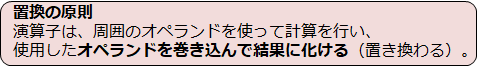

例えば`1+5`の場合、「+」演算子はオペランド`1`と`5`を足した計算結果である`6`に置き換わります。

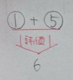

演算子が複数ある式`1+5-3`では、段階的に評価が行われます。  
まず`1+5`の部分が計算結果`6`に置き換わり、式は`6-3`という形になります。  
次にその式が評価され、最終結果である`3`に置き換わって計算が終了します。

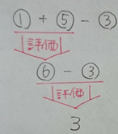

if文で学んだ比較演算子も、評価されて置き換わるという特性を持っています。  
具体的には、関係が成立するなら**true(真)** に、そうでないなら**false(偽)** に置き換わります。

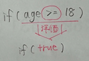

したがってif文は、条件式の評価結果が**真**なら一番上のブロックを、**偽**なら下のブロックを実行する文であるといえます。

## 評価の優先順位 
複数の演算子がある式は、演算子ごとに**優先順位**が決められています。

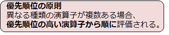

例えば、「**+**」演算子は5番目、「*」 演算子は4番目という順位であり、式`1+5*3`では先に掛け算が行われます。  
もし足し算を優先したいのであれば、「**()**」(**丸カッコ**)を使うことで評価の順位を引き上げることができます。

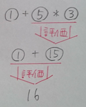　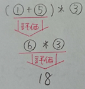

優先順位については感覚的に身につくと思います。

## 結合の規則 
同じ優先順位の演算子が2つ以上あるときは、評価の方向が重要になります。

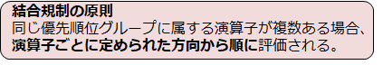

全ての演算子には、評価の方向が**結合規則**として定められています。  
「+」演算子では、**左から**評価されることになっています。  
「=」 演算子では、**右から**評価されることになっています。

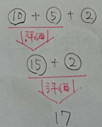　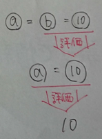

ここでは、使う頻度が高い演算子に絞って優先順位や結合規則をまとめました。  
学習したときにこの表に戻ってくるのがいいと思います。

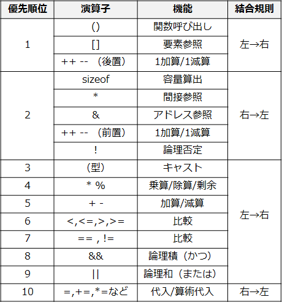
