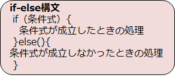
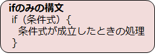
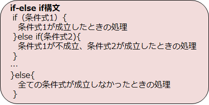

# C言語　第3回　
第3回では、分岐について、特にif文を学び、電卓プログラムをパワーアップさせていきます。  
また、条件を指定するための演算子についても学びます。
     
  - [条件式](#条件式)  
  - [if文](#if文)
  - [電卓プログラム](#電卓プログラム)

--------------------------------
  
## 条件式
分岐する条件・繰り返しを続ける条件のことを**条件式**といいます  （ここでは、分岐する条件）。
分岐や繰り返しを行いたいときに利用されます。  

条件式を立てるときは**比較演算子**と呼ばれる演算子を用います。  
なお、数値の比較はできますが、文字列の比較（辞書順にするなど）は行えません。  

|比較演算子|使い方|説明|
|:---:| :---: | :---: |
|==|a==b|aとbが同じである(a=b)|
|!=|a!=b|aがbではない(a≠b)|
|<|a<b|aがbよりも小さい|
|>|a>b|aがbよりも大きい|
|<=|a<=b|aがb以下である(a≦b)|
|>=|a>=b|aがb以上である(a≧b)|

2つ以上の条件を組み合わせて、より複雑な条件式を使いたい場合は、  **論理演算子**を用います。
|論理演算子|説明|意味|
|:---:| :---: | :---: |
|&&|かつ|両方の条件が満たされたらtrue|
|｜｜|または|どちらかの条件が満たされたらtrue|
|!|否定|条件が満たされなかったらtrue|

## if文  
if文を使えば、処理を分岐させることができます。

複数の文章のまとまりを**ブロック**と呼びます。  
if文にはifブロック、else ifブロック、elseブロックが存在します。  

---
基本形は**if-else構文**です。条件式が成立したときとしなかったときで、処理を分けることができます。  



条件式が成立しなかったときには何もしない場合、elseブロックを省略できます。  
これは**ifのみの構文**となります。  



条件式が成立しなかった時には別の条件式で判定したい場合は、
ifブロックのあとにelse ifブロックを追加した**if-else if構文**を使用します。  



下のコードは、**if-else if構文**を用いたプログラムの例です。  
``` C
#include <stdio.h>

int main(void) {
   int num;

   printf("数字を入力してENTERボタンを押してください\n");
   scanf("%d",&num);

   int result = num % 3;
	
   if(result == 0){
      printf("余りは0");
   }else if(result == 1){
      printf("余りは1");
   }else{
      printf("余りは2");
   }
   return 0;
}
```

下のコードは、**if-else if構文**を用い、  なおかつ論理演算子も用いたプログラムの例です。  
``` C
#include <stdio.h>

int main(void) {
   int age; /* 年齢を表す変数　*/

   printf("数字を入力してENTERボタンを押してください\n");
   scanf("%d",&age);
	
   if((age >= 0) && (age < 7)){ /* 7歳未満　*/
      printf("未就学児、または小学1年生\n");
   }else if((age >= 7) && (age <= 11)){ /* 7歳以上11歳以下　*/
      printf("小学生\n");
   }else if(age == 12) { /* 12歳　*/
      printf("小学6年生、または中学1年生\n");
   }else if((age >= 13) && (age <= 14)){ /* 13歳以上14歳以下　*/
      printf("中学生\n");
   }else if(age>14){ /* その他 */
      printf("中学3年生以上");
   }else{ /*エラー処理 */
      printf("ERROR!");
   }
   return 0;
}
```    

## 電卓プログラム
これまでの内容を踏まえて、以下の条件を満たすプログラムを作ってみましょう。  

- 整数を2回入力すると、四則演算の結果が表示される。  
- 四則演算のどれを行うのかをユーザーに選択させる  （0を入力したとき加算… など）  
- 指定した四則演算結果を表示する。  
- 商は実数値で表示する。    

余裕がある方は、0で割ってしまいそうになったときに`ERROR!`と表示させるようif文を組んでみましょう。

[電卓プログラム例](pc_03_1_code.md)

-----------------------------------
  第3回の補足資料です。
 細かいことが知りたい方はオススメです！
  [第3回補足資料](pc_03+.md) 