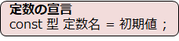
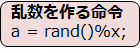
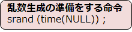

# C言語　第4回補足
定数と乱数について学んでいきましょう。特に乱数については使用頻度はかなり高いです。

  - [定数](#定数)
  - [乱数](#乱数)
  
## 定数
プログラムを作成している過程で、変数の値を上書きしたくないときがあると思います。  
**定数**とは、動作中にその内容が書き換わる必要のない**変数**です。
定数を用いることで、不要な書き換えを防止することができます。



``` C
#include <stdio.h>

int main(void){
   const int TAX = 110;
   int number = 500;

   printf ("合計金額：\n");
   printf("%d¥n",number*TAX/100);
   return 0;
}
```

上のプログラムは、以下のような流れで実行されます。  

　①定数として税率を定める　  
　②変数として商品の値段を定める  
　③商品の税込み価格を表示  

5行目で`500`を誤って定数に代入してしまうと、コンパイルエラーがしっかりと発生します。

## 乱数
**乱数**とは、ランダムで何が出るか分からない数字のことです。  
確率・統計的な処理や、数値シミュレーションには欠かせません。

  

・`x`は1以上の整数であり、発生させる乱数の上限値（指定値は含まない）  
・プログラムの先頭に `#include <stdlib.h>` が必要

この命令を呼び出すと、`0`以上かつ`x`未満の整数が変数`a`に代入されます。
それぞれの数字は同じ確率で現れます。



・rand を使う前に一度だけ実行しておけばよい。  
・プログラムの先頭に`#include <stdlib.h>` と `#include <time.h>` が必要

``` C
#include <stdio.h>
#include <stdlib.h>
#include <time.h>

int main(void){
   srand(time(NULL));
   int r = rand() % 100;

   printf("あなたは%d歳？" , r );
   return 0;
}
```
・ `#include <time.h>` と`srand(time(NULL))` が無ければ、何回プログラムを実行しても毎回同じ数字が出てしまいます。

上のプログラムを実行すると、0～99のいずれかの整数が`r`にランダムに代入されます。
