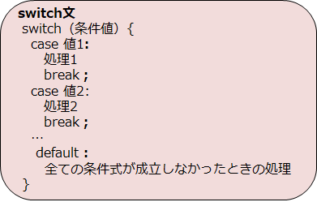

# C言語　第4回　
第4回では、分岐について、特にswitch文を学び、if文との違いについて見ていきます。  
     
  - [switch文](#switch文)  
  - [電卓プログラム](#電卓プログラム)
  
## switch文  
switch文を使えば、処理を分岐させることができます。   
switch文は多分岐と呼ばれ、3つ以上の処理のどれか1つを実行したい場合に  if文よりも好まれて使われます。

if文の全ての条件式が **比較演算子「==」** を使っていて、比較する値が整数（またはそれに類するもの）である場合、    
if文はswitch文に書き換えることができます。  
  


switch文を記述する際は、以下の点に注意してください。  
  - switch の直後の`()`の中には変数名を指定し、条件式は書かない。     
  - caseの右には値を書き、`:`（コロン）を付ける。   
  - caseの後に値には変数は記述できない（定数は可）。  
  - case … の各処理の最後には、必ずbreak文 `break;`を記述する。  
  - `default:` という記述は、合致するcaseがないときに実行する処理が  不要な場合は省略可能である。
ただし非推奨。  
  
下のコードは、switch文を用いた簡単な偶数奇数判定プログラムの例です。  
``` C
#include <stdio.h>

int main(void){
   int num;
   printf("値を入力してください\n");
   scanf("%d",&num);

   switch(num%2){
      case 0:
         printf("偶数です");	
         break;

      case 1:
         printf("奇数です");
         break;

      default:
         printf("他の値です");
   }
   return 0;
}

```
  
### break文
switch文には「break文がなければ次のcaseも実行してしまう」という特性があります。  
そのため基本的にはbreak文は必須ですが、あえて逆手にとることもできます。  

下のコードは、あえてbreak文を書かないプログラムの例です。  
``` C
#include <stdio.h>

int main(void) {
   int kekka;

   printf("今回のCBTのレベルを1~7で入力してください\n");
   scanf("%d",&kekka);		//1~7までの整数値を入力
   printf("レベルは%dです\n",kekka);

   switch(kekka){
   case 1:
   case 2:
      printf("うーん…\n");	//kekkaが1か2であるときの処理
      break;
   case 3:
   case 4:
      printf("普通です\n");	//kekkaが3か4であるときの処理
      break;
   case 5:
   case 6:
      printf("あと少しですー\n");   //kekkaが5か6であるときの処理
      break;
   case 7:
      printf("おめでとうございます！");	//kekkaが7であるときの処理
      break;
   default:
      printf("ERROR!");   //kekkaが1～7ではないときの処理
      break;
   }
   return 0;
}
```    

## 電卓プログラム
これまでの内容を踏まえて、以下の条件を満たすプログラムを作ってみましょう。  

- 整数を2回入力すると、四則演算の結果が表示される。  
- 四則演算のどれを行うのかをユーザーに選択させる  （0を入力したとき加算… など）  
- 指定した四則演算結果を表示する。  
- 商は実数値で表示する。

内容は前回と同様です。  
if文をswitch文に書き換えることで、switch文を使うメリットを感じましょう。  
[電卓プログラム例](pc_04_1_code.c)

-----------------------------------
  第4回の補足資料です。
 必須の知識なので、必ず見るようにしてくださいー（特に乱数）  
  [第4回補足資料](pc_04+.md) 
