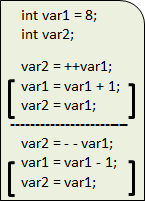
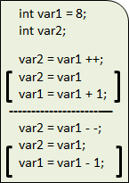

# C言語　第5回補足
代入演算子とインクリメント・デクリメント演算子について学んでいきましょう。  
コードをシンプルなものにしたい時や、for文の時によく使われます。

  - [代入演算子](#代入演算子)
  - [インクリメント･デクリメント演算子](#インクリメント演算子とデクリメント演算子)
  
## 代入演算子
右辺の内容を左辺の変数に代入する演算子を**代入演算子**といいます。  
「＝」以外に、他の算術演算子と組み合わせた演算子が用意されています。  

|代入演算子|記述例|意味|  
|:---:|:---:|:---:| 
|+=|a += b|a = a + b|  
|-=|a -= b|a = a - b|  
|*=|a *= b|a = a * b|  
|/=|a /= b|a = a / b|

## インクリメント演算子とデクリメント演算子
算術演算の中でも、変数の値を1だけ増加・減少させるという演算は特に利用されることが多いです。  
1だけ増加させる演算子を**インクリメント演算子**といい、「++」を使います。  
1だけ減少させる演算子を**デクリメント演算子**といい、「- -」を使います。  

インクリメント演算子とデクリメント演算子には、それぞれ前置きと後置きの2種類が存在します。  
下のコードの中の大括弧「[ ]」は、インクリメント・デクリメント演算子を使わないで書いた場合です。

前置きの場合には、**インクリメント・デクリメント演算子による演算**を先に行います。  
その後、それ以外の処理が行われます。

（インクリメント）
①変数var1が**1増加**
②変数var2に`8 + 1 = 9`を代入  
（デクリメント）　
①変数var1が**1減少**
②変数var2に`8 - 1 = 7`を代入

（インクリメント）
①変数var2に`8`を代入
②変数var1が**1増加**  
（デクリメント）　
①変数var2に`8`を代入
②変数var1が**1減少**

後置きの場合には、**インクリメント・デクリメント演算子による演算以外の処理**を先に行います。  
その後、インクリメント・デクリメント演算子による演算が行われます。
