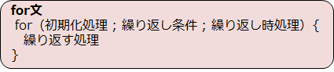

# C言語　第5回　
第5回では、繰り返しについて、特にfor文について学び、電卓プログラムをパワーアップさせていきます。    
     
  - [for文](#for文)  
  - [電卓プログラム](#電卓プログラム)
  
  -----------------------
## for文  
コンピュータは、同じことを何回も繰り返すことができます。   
回数の決まっている繰り返しには、**for文**を使用することが多いです。  



####初期化処理
for文による繰り返しを始める前に、最初に一回だけ実行される文です。
通常、何回目のループなのかを記録する変数の宣言や初期化を行います。

このような変数を**ループ変数**といいます。ループ変数は1文字の変数名（特に「**i**」）にすることが多いです。
for文内での計算や表示などの処理に用いることができます。（コード例を見てもらった方がイメージしやすいと思います。） 

####繰り返し条件
ループを継続するかしないかを判定する条件式です。  
評価結果が真である間は、処理が繰り返し実行されます。

####繰り返し時処理
処理直後に自動的に実行される文です。
通常は、インクリメント演算子（参考：[第5回補足資料](pc_05+.md)）を用いて変数の値を1だけ増やす文を書きます。

 下のコードは、第1回目～第3回目まで出力するプログラムの例です。  

``` C
#include <stdio.h>

int main(void) {
   for( int i=0 ; i<3 ; i++ ) {
      printf("%d回目です\n" , i+1) ;
   }
   printf("終了しました\n") ;
   return 0;
}	
```

for文の中にfor文を入れるなどして、ループの入れ子状態を作ることができます。
下のコードは、`j`が3回ループしたら`i`が1回ループするようになっており、
クラスが3組まで表示されたら学年が1つ上がるプログラムの例です。

``` C
#include <stdio.h>

int main(void) {
   for( int i=0 ; i<3 ; i++ ) {
      for(int j=0;j<3 ; j++){
         printf("%d年%d組\n" , i+1 , j+1) ;
      }
		
   }
   printf("終了しました\n") ;
   return 0;
}	
```

以下のリンクを参照してもらえれば、九九のプログラムも作れます。
[ループの入れ子で九九を表示する](https://bit.ly/3RHA0sc)     

## 電卓プログラム
これまでの内容を踏まえて、以下の条件を満たすプログラムを作ってみましょう。  

- 整数を2回入力すると、四則演算の結果が表示される。  
- 四則演算のどれを行うのかをユーザーに選択させる  （0を入力したとき加算… など）  
- 指定した四則演算結果を表示する。  
- 商は実数値で表示する。
- 同様の流れを3度行う。

[電卓プログラム例①](pc_code_05_01.md)

＜発展＞
最初に何回ループするかをscanf関数でユーザーに指定させて、その回数だけ電卓計算を行うプログラムを作ってみましょう。

[電卓プログラム例②](pc_code_05_02.md)

-----------------------------------
  第5回の補足資料です。
 かなり重要な事項について触れています。
  [第5回補足資料](pc_05+.md) 