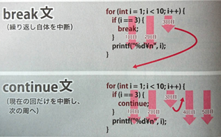

# C言語　第6回補足
代入演算子とインクリメント・デクリメント演算子について学んでいきましょう。  
コードをシンプルなものにしたい時や、for文の時によく使われます。

  - [繰り返しのネスト](#繰り返しのネスト)
  - [繰り返しの中断](#繰り返しの中断)
  - [無限ループ](#無限ループ)
  - [goto文](#goto文)
  
## 繰り返しのネスト
これまで学んできた分岐（if文・switch文）や繰り返し（for文・while文）の制御構造は、その中に別の制御構造を含むことができます。  
このような多重構造のことを、**入れ子**や**ネスト**といい、繰り返し処理の中での分岐構造を作ることができます。

ループの入れ子で九九を表示してみましょう。
``` C
/* 九九一覧表 */
#include <stdio.h>
 
int main(void)
{
   int i, j;
 
   for(i=1; i<=9; i++){
      printf("%dの段\t", i);    /* 段数表示 */
         for(j=1; j<=9; j++){
            printf("%3d", i*j);    /* 九九の表示 */
         }
         printf("\n");    /* 段ごとの改行 */
   }
   return 0;
}
```

 - 1～9の段までそれぞれに1～9を掛けるため、外側ループと内側ループの条件は基本的に同じ
 - カウンタ変数同士を掛ける。表示の際に隙間を空けるためにprintf関数の書式で`%3d`を指定。
 - 段ごとに改行をする必要があるので、内側のfor文が終了したらprintf関数で改行を実行する
 - 段ごとに改行をする必要があるので、内側のfor文が終了したらprintf関数で改行を実行するようにする

## 繰り返しの中断
処理によっては、繰り返しを最後まで行わずに途中で中断したいことがあります。  
その場合は、**break文**と**continue文**という2種類の方法によって中断することができます。

break文はループそのものを中断し、ループの次に記述された処理へと進みます。  
一方のcontinue文は、ループの現在の回だけを中断してループの先頭へ戻り、次の回のループを継続します。  
**※多重ループの場合、break文、continue文は現在のループに対してのみ有効です。**

下のコードは、break文とcontinue文を用いて、第1回目～第5回目までの内奇数回を出力するプログラムの例です。

``` C
#include <stdio.h>
 
int main(void){
 
  /* 繰り返し処理 */
  for(int i=1;i<=10;i++) {
    // 変数iが偶数のときループをスキップ
    if(i%2==0){
      continue;
    }
   
    printf("第%d回目\n", i);
    //変数iが6のとき、forループから抜ける
    if((i+1)==6){
      break;
    }
  }
  return 0;
}
```

## 無限ループ
強制的に停止しない限り永久に繰り返しを続ける制御構造のことを**無限ループ**といいます。



**○あらかじめ繰り返したい回数が決まっている場合はfor文**  
**○条件が満たされている場合は何回でも繰り返したい場合はwhile文**  

下のコードは、break文とcontinue文と無限ループを用いて、第1回目～第5回目までの内奇数回を出力するプログラムの例です。
``` C
#include <stdio.h>
 
int main(void){
   int i=0;
  /* 無限ループ */
  while(1) {
    
    // 変数iが偶数のときループをスキップ
    if(i%2==0){
      i++;
      continue;
    }
    printf("第%d回目\n", i);
    //変数iが6のとき、forループから抜ける
    if(i+1==6){
      break;
    }
    i++;
  }
  return 0;
}
```

## goto文
C言語では、ソースコード中の任意の場所に**ラベル**を書くことで、印を付けておくことができます。**ラベル名は自由**です。  
そして、**goto文**でラベルを指定すると、そのラベルの位置が次に実行される文になります。

　  
下のコードは、goto文を使ったプログラムの例です。5重ループから抜け出すことができます。
```　C
#include <stdio.h>
 
int main(void){
  for(int i=0; ;i++){
    for(int j=10;;j++){
      for(int k=20;;k++){
        for(int m=30;;m++){
          for(int n=40;;n++){
            printf("iの値:%d\n",i);
            printf("jの値:%d\n",j);
            printf("kの値:%d\n",k);
            printf("mの値:%d\n",m);
            printf("nの値:%d\n",n);
            goto END;
          }  
        }
      }
    }
  }
  END:
    printf("終了します");
    return 0;
}
```

このようにgoto文は深くネストしたループを一気に脱出する際には用いるべきですが、  
バグの原因にもなるので**原則としては使用禁止することをオススメします**。
