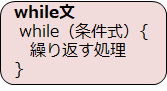

# C言語　第6回　
第6回では、繰り返しについて、特にwhile文を学び、for文との違いについて見ていきます。  
     
  - [while文](#while文)  
  - [電卓プログラム](#電卓プログラム)

## while文  
回数の決まっていない繰り返しには、**while文**を使用することが多いです。  



処理を実行する前に条件式を評価します。
評価結果が**真**である間は、処理が繰り返し実行されます。

※処理を実行した後に条件式を評価する場合は、「**do-while文**」を用います。  
　あまり利用しないので、以下のサイトを参照してほしいです。  
　[do-while文](https://bit.ly/3aGthhO)     

 下のコードは、第1回目～第3回目まで出力するプログラムの例です。  
``` C
#include <stdio.h>

int main(void){
   int i=0;
   while(i<3){
      printf("%d回目です\n",i+1);
      i++;
   }
   printf("終了しました\n");
   return 0;
}
```
この場合は変数`i`の値をwhile文の最後で更新してしまっているので、for文を用いたほうがいいとされています。

while文の中にwhile文を入れるなどして、ループの入れ子状態を作ることができます。下のコードは、  
`j`が3回ループしたら`i`が1回ループするようになっており、クラスが3組まで表示されたら学年が1つ上がるプログラムの例です。
``` C
#include <stdio.h>

int main(void) {
   int i=0,j=0;
   while(i<3){
      while(j<3){
         printf("%d年%d組\n" , i+1 , j+1) ;
         j++;
      }
      i++;
   }
   printf("終了しました\n") ;
   return 0;
}	
```
この場合も同じように、変数`i`と変数`j`の値をwhile文の最後で更新してしまっているので、  
for文を用いたほうがいいとされています。

## 電卓プログラム
これまでの内容を踏まえて、以下の条件を満たすプログラムを作ってみましょう。  

・整数を2回入力すると、四則演算の結果が表示される。  
・四則演算のどれを行うのかをユーザーに選択させる  
 （0を入力したとき加算… など）  
・指定した四則演算結果を表示する。  
・商は実数値で表示する。  
・同様の流れを3度行う。  
（3回処理が行われたら（`i=2`の処理が行われたら）終了するようwhile文を用いる）

[電卓プログラム例](pc_code_06_01.md)

-----------------------------------
  第6回の補足資料です。  
 while文を使う意義なども含めて、最重要事項について触れています。  
  [第6回補足資料](pc_06+.md) 
