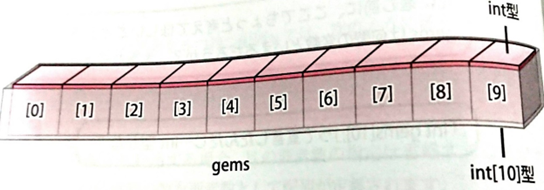
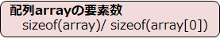

# C言語　第7回補足
配列の型についてと、配列を扱う手間を省くための方法について学んでいきましょう。  
     
  - [配列の型](#配列)  
  - [配列の要素数](#配列の要素数) 
  - [マクロ定数](#マクロ定数)
  - [プログラム例](#プログラム例)
  
---------------

## 配列の型
`int gems[10];`と宣言したとしましょう。この変数は何型といえるでしょうか？



配列変数gemsのデータ型は、C言語の世界では**int配列型**（あるいは**int [10]型**（要素数省略可））と言われます。「int型の小箱を複数持つ配列の型」と解釈しましょう。
int型には1つの値しか格納できませんが、int配列型には複数の値を格納することができます。

## 配列の要素数
配列の要素数を求める直接的な方法は用意されていませんが、計算して求めることはできます。

C言語には、変数や配列のサイズを求める**sizeof演算子**があります。


配列の全体のサイズを求め、それを要素1つのサイズで割れば要素の数が分かります。
配列arrayの要素数を計算するには次のようにします。



0番目の配列の要素は必ず存在するので、添え字として0を指定しています。

## マクロ定数
C言語には、数値に名前を付ける方法が用意されています。それが **#define疑似命令**です。


・文の終わりに「**;**」を付けてはいけない。
・プログラムの先頭に置くのが一般的である。
・名前には**大文字のアルファベット**が一般的である。

この**マクロ定数**を用いることで、名前をつけた部分を修正するだけで全ての数値が修正されるほか、
ただの数値よりも意味が分かりやすくなるという効果があります。

マクロ定数を配列の要素数に用いることで、プログラム内の変更を1行書き直すだけで行うことができます。

##プログラム例

``` C
#include <stdio.h>

int main(void){

   int a[10] = {4, 2, 11, 4, 15, 7, 9, 12, 3, 6};
   int i, sum;

   for (i = 0; i < 10; i++) {
      printf("a[%d] = %d\n", i, a[i]);   /* 配列内容の表示 */
   }
    printf("\n");
    
   sum = 0;
   for (i = 0; i < 10; i++) {
      sum = sum + a[i];    /* 総和の計算 */
    }
   printf("合計点： %d\n", sum);

   return 0;
}
```

上のコードは、配列内の全ての要素を表示し、その総和を表示するプログラムの例です。
このプログラムをsizeof演算子とマクロ定数を用いることで書き直してみましょう。

``` C
#include <stdio.h>

int main(void){

   int a[10] = {4, 2, 11, 4, 15, 7, 9, 12, 3, 6};
   int i, sum;

   for (i = 0; i < sizeof(a)/sizeof(a[0]); i++) {
      printf("a[%d] = %d\n", i, a[i]);   /* 配列内容の表示 */
    }
   printf("\n");
    
   sum = 0;
   for (i = 0; i < sizeof(a)/sizeof(a[0]); i++) {
      sum = sum + a[i];                        /* 総和の計算 */
   }
   printf("合計点： %d\n", sum);

   return 0;
}
```

sizeof演算子を用いたことで、配列の要素数が`10`から変更した際の修正の手間を省くことができます。

``` C
#include <stdio.h>
#define N 10

int main(void){

   int a[N] = {4, 2, 11, 4, 15, 7, 9, 12, 3, 6};
   int i, sum;

   for (i = 0; i < N; i++) {
      printf("a[%d] = %d\n", i, a[i]);   /* 配列内容の表示 */
   }
   printf("\n");
    
   sum = 0;
   for (i = 0; i < N; i++) {
      sum = sum + a[i];                        /* 総和の計算 */
   }
   printf("合計点： %d\n", sum);

   return 0;
}
```

マクロ定数を用いたことで、`N`という定数をプログラムの中全てで用いることができるので、
`N`の値を更新するだけで全ての値の修正が完了します。
