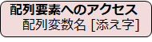

# C言語　第7回　
第7回では、配列について学び、異なるデータをひとまとまりとして扱えるようになりましょう。  
     
  - [配列](#配列)  
    - [配列の宣言](#配列の宣言)
    - [配列要素へのアクセス](#配列要素へのアクセス)
    - [配列の初期化](#配列の初期化)
      - [要素数を指定しないで初期化](#要素数を指定しないで初期化)
      - [初期値の数が要素数より少ない場合](#初期値の数が要素数より少ない場合)
    - [配列の利用例](#配列の利用例)
  - [電卓プログラム](#電卓プログラム)

---------------------------
  
## 配列
例えば、240人の成績データを管理したいとしましょう。
いちいち240個もの変数を宣言したくないものです。

同じ種類の複数のデータを並び順で格納するデータ構造を**配列**といいます。  


-  箱の1つ1つを**要素**といい、変数と同じように型があり、データを格納できる。  
-  配列の各要素の型は全て同じであり、番号がついている。  
この要素の番号を**添え字**（**index**）といい、0から始まる決まりになっている。  
`例：要素が5つある配列では、5番という添え字の要素はない`

### 配列の宣言
配列を利用するには、まず、いくつの要素が必要になるかを決めます。  
その後要素の型を決めて、配列変数を宣言します。


例えば、`int array[5];` と記述した場合は、
int型の要素が5個並んだ配列変数 array が利用できるようになります。

### 配列要素へのアクセス
配列に含まれるそれぞれの要素は、以下の方法で利用可能になります。



下のコードは、配列arrayの先頭から2番目の要素に3を代入し、それを出力するプログラムの例です。  
``` C
#include <stdio.h>

int main(void){
   int gems[10];

   gems[1] = 3;
   printf("%d¥n",gems[1]);

   return 0;
}
```

### 配列の初期化
配列を宣言した直後には各要素にどのような値が入っているか分からないために、  
変数同様に宣言と同時に値を代入（**初期化**）するべきです。


例えば、`int array[5] = {10 , 20 , 30, 40, 50};` と記述した場合は、要素数5の配列`array`が初期化されます。  
**※この波括弧を使って配列に代入する方法は、配列の宣言時にしか使うことができない。**

#### 要素数を指定しないで初期化
配列の宣言と初期化を同時に行う場合は、要素数の指定を省略できます。

例えば、`int array[] = {10 , 20 , 30, 40, 50};` と記述した場合は、  
**{}** 内に記述した初期値の数を要素数として配列が定義されます。  
`int array[];` と、要素数も初期値も省略して記述することはできません。

#### 初期値の数が要素数より少ない場合
**{}** 内に記述した初期値の数が、指定した要素数に対して不足していても初期化することができます。  
この場合、足りない分は0で初期化されることになっています。

例えば、`int array[] = {10 , 20 , 30};` と記述した場合は、残った要素 `array[3]` と `array[4]` は0で初期化されます。

全要素を0で初期化する処理は、`int array[] = {};`というように書くことができます。

### 配列の利用例
配列はループ処理と組み合わせて使うと価値が上がるといわれています。

 下のコードは、配列に代入した3つの数値の平均値を求めるプログラムの例です。

``` C
#include <stdio.h>

int main(void){
   float scores[3] = {90,85,70};
   float sum = 0;

   for(int i=0;i<5;i++){
      sum += scores[i];
   }

   float average = sum/5;
   printf("平均点：%f\n",average);
   return 0;
}
```

下のコードは、配列内の全ての要素を表示し、その総和を表示するプログラムの例です。

``` C
#include <stdio.h>

int main(void){

   int a[10] = {4, 2, 11, 4, 15, 7, 9, 12, 3, 6};
   int i, sum;

   for (i = 0; i < 10; i++) {
      printf("a[%d] = %d\n", i, a[i]);   /* 配列内容の表示 */
   }
   printf("\n");
    
   sum = 0;
   for (i = 0; i < 10; i++) {
      sum = sum + a[i];                        /* 総和の計算 */
   }
   printf("合計点： %d\n", sum);

   return 0;
}
```

よく使うので覚えておきましょう。

## 電卓プログラム
これまでの内容を踏まえて、以下の条件を満たすプログラムを作ってみましょう。  

・配列に演算子4つ（「+」「-」「×」「÷」）を代入する（半角です）  
・整数を2回入力すると、四則演算の結果が表示される。   
・四則演算のどれを行うのかをユーザーに選択させる  (0を入力したとき加算… など)  
・指定した四則演算結果を表示する。   
・商は実数値で表示する。  
・演算結果を表示する際に、配列を使う  
（if文の中で、（ある変数）＝0のときprintf("〇+〇"）…としていたはずですが、  
　配列から「+」を取得し、printf("〇%c〇" , ある変数）のように出力しましょう）  
・繰り返す回数は任意。コード例では1回。  

[電卓プログラム例](pc_code_07_1.md)

---
  第7回の補足資料です。  
 配列を扱う際の記述の手間が省けるかもしれません。  
  [第7回補足資料](pc_07+.md) 
