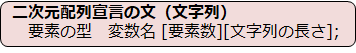
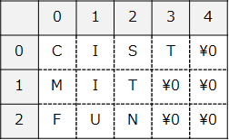
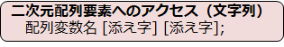
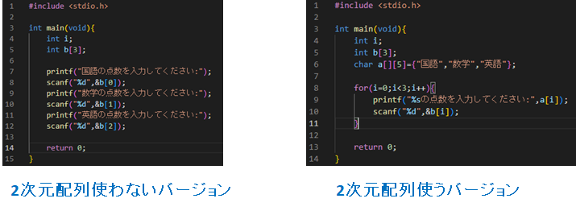
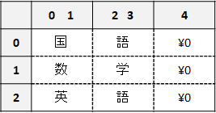
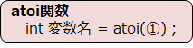

# C言語　第8回補足
配列で文字列を扱う方法について学んでいきましょう。  
     
  - [文字型](#文字型)  
  - [文字列](#文字列) 
     - [1次元配列と文字列](#1次元配列と文字列) 
     - [2次元配列と文字列](#2次元配列と文字列) 
     - [文字列の利用例](#文字列の利用例)
  - [atoi関数](#atoi関数)

  ------------------

## 文字型
**文字**を変数に代入するためには、C言語では**char型**を用います。
・「**'**」（**シングルクォーテーション**）でくくる。
・変換指定子は「**%c**」。

下のコード例は、`CIST`と出力するプログラムの例です。  
``` C
#include <stdio.h>

int main(void){
   char uni = 'T';
   printf("CIS%c¥n",uni);
   return 0;
}
```
char型の変数`uni`に文字`T`を代入しています。


## 文字列
###1次元配列と文字列
**文字列**を変数に代入するためには、C言語では**char型の配列**を用います。
全角1文字は文字列として扱わなければなりません。また、半角1文字は文字列としても扱うことができます。
 - 「**"**」（**ダブルクォーテーション**）でくくる。
 - 変換指定子は「**%s**」。

下のコードは、`CIST-CIST`と出力するプログラムの例です。  
``` C
#include <stdio.h>

int main(void){
    char uni1[5] = {'C', 'I', 'S', 'T'}; 
    char uni2[5] = "CIST";
    printf("%s-%s",uni1,uni2);
    return 0;
}
```
4行目の記述は、文字列を代入するときに文字を1つずつ並べる方法です。
**※「**'**」を複数並べただけの形であり、あまり実践的ではない**

5行目の記述は、文字列を代入するときに文字の集まりを文字列として扱う方法です。
この記述方法の際には、文字列代入の際に自動的に文字列の最後に **¥0**（**ヌル文字**）が
代入されるので、**必要な文字数+1**文字が配列の要素数として最低限必要です。
  -  どちらの方法でも、宣言と同時に初期化した場合、要素数を省略できる
  -  宣言後に文字列を代入することはできない

###2次元配列と文字列

文字列を複数個変数に代入したい場合は、2次元配列を使います。



下のコード例は、配列から1つの文字列を指定して、`CIST`と出力するプログラムの例です。
``` C
#include <stdio.h>

int main(void){
   char uni [3][5] = {"CIST", "MIT", "FUN"}; 
   printf("%s",uni[0]);
   return 0;
 }
```

実行イメージは以下の通りです↓



2次元配列の添え字を上手く利用することで、1文字だけ取り出すこともできます。



例：`uni[0]` … `CIST`が取り出せる
　　`uni[0][3]` … `T`が取り出せる

ここまでの内容で、参考になりそうなサイトを以下に挙げます。

[参考サイト①](https://bit.ly/3QpnP2y)  　[参考サイト②](https://bit.ly/3OhgtMT)  

## 文字列の利用例
2次元配列を使うと、スマートなコードを書ける場面があります。
下のコード例は、3科目の点数を、配列`b[ ]`に入力させるプログラムの例です。



実行イメージは以下の通りです↓



全角文字は2バイトで1文字となるので、要素数を指定する際には注意が必要です
（※2年春に詳しく学習します　環境によっては2バイトで1文字ではないものも）

このコードでは**配列要素が全角文字**であるため、1つずつ文字を取り出すことはできません。

例：`a[0]` … 「国語」が取り出せる
　　`a[0][3]` … 何も取り出すことができない！

## atoi関数
文字列を整数に変換する場合には、**atoi関数**を用います。



  - ①は整数に変換したい文字列（`"4649"`など）。
  - プログラムの先頭に `#include <stdlib.h>` が必要


#### ＜注意点＞
※数値ではない数字が途中に含まれていたら、その**文字から後ろはすべて無視**される
※数字が含まれていない場合は、**0**が返される。

以下のコードは、は`来年は2023年`と出力するプログラム例です。
``` C
#include <stdio.h>
#include <stdlib.h>

int main(void){
   char uni[ ] = " 2022 ";
   int year = atoi (uni) ;
   printf("来年は%d年",year+1);
   return 0;
}
```

配列`uni[]`に文字列の`"2022"`が入っていましたが、atoi関数を用いることで、`2022`の数値計算ができるようになりました。