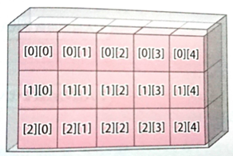
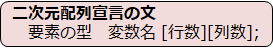
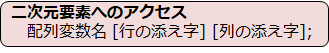
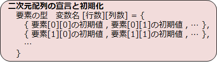
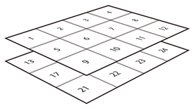
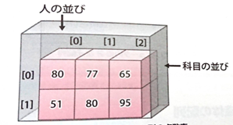

# C言語　第8回　
第8回では、多次元配列について学び、データを表のようにして扱えるようになりましょう。  
また、配列を扱う際の注意点についても確認しましょう。
     
  - [二次元配列](#二次元配列)  
  - [多次元配列](#多次元配列)  
  - [二次元配列の利用例](#二次元配列の利用例)
  - [配列の注意点](#配列の注意点)
      -  [配列の表示](#配列の表示)  
      - [配列の計算や比較](#配列の計算や比較)
      - [配列の代入（コピー）](#配列の代入（コピー）)
  - [電卓プログラム](#電卓プログラム)

## 二次元配列
配列そのものを要素として持つ配列を作成することができます。  
これまで学習してきた配列（一次元配列）に縦の並びを加えると、**二次元配列**になります。  
  

  

  

### 二次元配列の初期化

  

-  二次元配列で初期化をする際は、「行数」を省略できる。  
-  指定した要素数（行数×列数）に対して初期値の数が足りない場合、
足りない分は0で初期化される。
  
## 多次元配列
次元はいくらでも増やすことができます。二次元配列のような配列を**多次元配列**といいます。  
たまに三次元配列が使われるくらいで、四次元配列以上はほとんど使われません。

  

三次元配列のイメージは上の通りです。

## 二次元配列の利用例
下のコードは、ある2人の3科目のテスト結果を格納したプログラムの例です。

``` C
#include <stdio.h>

int main(void){
   int i,j;
   int scores[2][3];
   scores[0][0] = 80;
   scores[0][1] = 77;
   scores[0][2] = 65;
   scores[1][0] = 51;
   scores[1][1] = 80;
   scores[1][2] = 95;

   for(i=0;i<2;i++){
      printf("%d人目の点数を表示します\n",i+1);
      for(j=0;j<3;j++){
         printf("%d科目め:%d\n",j+1,scores[i][j]);
      }
   }
   return 0;
}
```

図にすると以下のようなイメージになります。  



## 配列の注意点
### 配列の表示
printf関数に配列変数そのものを引き渡すことはできません。例えば、
``` C
int array[5] = {10 , 20 , 30, 40, 50};
printf("%d",array);
```
と記述しても、全要素を表示させることはできません。

面倒ではありますが、for文などのループ処理で要素を1ずつ取り出しながら表示するしかありません。

### 配列の計算や比較
配列変数そのものに算術演算子や比較演算子を使うと、想定外の動作をします。例えば、
``` C
int arrayA[5] = {10 , 20 , 30, 40, 50};
int arrayB[5] = {10 , 20 , 30, 40, 50};
int arrayC[5] = arrayA + arrayB;
```
と記述しても、配列の和を計算することはできません。

### 配列の代入（コピー）
配列では、**=** 演算子を使って配列変数に他の配列の内容をまるごと代入（コピー）することはできません。例えば、
``` C
int arrayA[5] = {10 , 20 , 30, 40, 50};
int arrayB[5] ;
arrayA = arrayB;
```
と記述しても、配列の内容を代入することはできません。

下のコードは、要素を1つずつ代入することで配列の内容をコピーしているプログラムの例です。

``` C
#include <stdio.h>

int main(void){
    int i,j;
    int scores[2][3];
    scores[0][0] = 80;
    scores[0][1] = 76;
    scores[0][2] = 63;
    scores[1][0] = 51;
    scores[1][1] = 90;
    scores[1][2] = 42;

    for(i=0;i<2;i++){
        printf("%d人目の点数を表示します\n",i+1);
        for(j=0;j<3;j++){
            printf("%d科目め:%d\n",j+1,scores[i][j]);
        }
    }
    return 0;
}
```

## 電卓プログラム
これまでの内容を踏まえて、以下の条件を満たすプログラムを作ってみましょう。  

・配列に演算子4つ（「＋」「ー」「☓」「÷」）を代入する（「÷」以外は全角です）  
・整数を2回入力すると、四則演算の結果が表示される。   
・四則演算のどれを行うのかをユーザーに選択させる  
　（0を入力したとき加算… など）  
・指定した四則演算結果を表示する。  
・商は実数値で表示する。  
・演算結果を表示する際に、配列を使う  
（if文の中で、（ある変数）＝0のときprintf("〇+〇"）…としていたはずだが、  
　配列から「＋」を取得し、printf("〇%s〇" , ある変数）のように出力しよう）  
・繰り返す回数は任意。コード例では1回。  

[電卓プログラム例](pc_code_08_1.c)

-----------------------------------
  第8回の補足資料です。  
 文字列を扱う方法について学びます。最重要事項です。  
  [第8回補足資料](pc_08+.md) 
