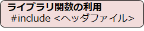
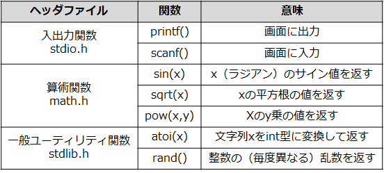

# C言語　第9回補足
自作ではない関数について学んでいきます。
     
  - [ライブラリ関数](#ライブラリ関数)  
---------------------
  
## ライブラリ関数
C言語には、よく使う便利な関数があらかじめ用意されています。このような関数を **（標準）ライブラリ関数**といいます。
プロトタイプ宣言や関数の中身の記述は**不要**で、ライブラリ関数名だけ書けば、その関数を利用できます。

  - ライブラリ関数を利用するには、参照したいヘッダファイルをインクルードする必要がある。

基本的によく使われるライブラリ関数を以下にまとめました。
詳しくは2年春「プログラミングとアルゴリズム基礎」で学習しますので、無理して覚えることはないと思います。

他の処理を行いたい場合はその都度調べる必要があります。