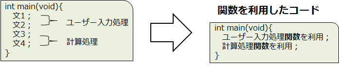
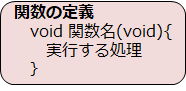
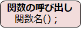
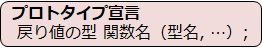

# C言語　第9回　
第9回では、自分で関数を作れるようにし、main関数以外の関数を利用するメリットについて学びましょう。
     
  - [関数](#関数)  
      -  [関数の定義](#関数の定義)  
      - [関数の呼び出し](#関数の呼び出し)
      - [関数の利用例](#関数の利用例)
      - [プロトタイプ宣言](#プロトタイプ宣言)
  - [電卓プログラム](#電卓プログラム)

  
## 関数
複数の文をまとめて1つの処理として名前をつけたものを**関数**といいます。  
main関数以外の自作関数を使用するメリットは以下の通りです。
-  main関数の役割を減らすことができる
-  プログラムの修正範囲を限定できる
-  同じ処理を1つの関数にまとめることで、作業効率が上がる。



関数を利用するには、①関数の作成　②関数の使用　というステップを踏みます。

### 関数の定義
関数を作成することを**関数の定義**といいます。  
シンプルな関数の場合は下のようにして定義します。



①関数名を定義するときは、分かりやすい名前をつけるよう強く意識する。  
②関数を定義すると、それより**下**のコードでその関数を利用できる。  
③関数定義の中では、別の関数は定義できない。

### 関数の呼び出し
関数を利用することを**関数の呼び出し**といいます。  
シンプルな関数の場合は以下のようにして呼び出します。



### 関数の利用例
下のコードは、`hello関数`の**定義**→**呼び出し**を行っているプログラムの例です。

``` C
#include <stdio.h>

void hello(void){ 
   printf("こんにちは");
}

int main(void){
   printf("呼び出し開始");
   hello();
   printf("呼び出し終了");

   return 0;
}
```

C言語には、**関数がいくつ定義されても、必ずmain関数から動き始める**  というルールがあるため、  
プログラムは7行目から動作を始めます。

### プロトタイプ宣言
「**main関数から動く**」ということから、main関数を一番上にしてコードを書きたい、  
と考える人のためにある機能が**プロトタイプ宣言**です。



**main関数の前に定義されていない関数は使うことができない**ですが、  
プロトタイプ宣言によって関数の名前だけ先に定義しておくことで、関数を呼び出せるようになります。  
 戻り値・引数などの言葉の意味は次回学びましょう。

 下のコードは、先ほどのプログラムをプロトタイプ宣言を用いて書き直したプログラムの例です。

``` C
#include <stdio.h>

void hello(void);

int main(void){
   printf("呼び出し開始");
   hello();
   printf("呼び出し終了");

   return 0;
}

void hello(void){
   printf("こんにちは");
}
```

## 電卓プログラム
これまでの内容を踏まえて、以下の条件を満たすプログラムを作ってみましょう。  

第5回目で作ったプログラム（[電卓プログラム例①](https://github.com/kiryu-3/prosa/blob/main/C/pc_1_05/pc_code_05_1.md)）を、関数を使用して書き直してみましょう。  
・ユーザーが入力する処理を`input関数`で表す  
・四則演算の処理を`calc関数`で表す

[電卓プログラム例](pc_code_09_1.md)

-----------------------------------
  第9回の補足資料です。  
 これまで学習した内容の理論的な内容です。見たい人は是非というレベルです。  
  [第9回補足資料](pc_09+.md) 
