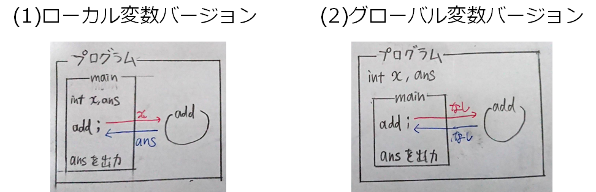

# C言語　第10回補足
変数の有効範囲について学んでいきます。
     
  - [ローカル変数とグローバル変数](#ローカル変数とグローバル変数)    
  - [グローバル変数の危険性](#グローバル変数の危険性)    

## ローカル変数とグローバル変数  
変数の値が有効に働く範囲（スコープ）は、関数の中でのみ有効でした。  
しかし、全ての関数で、 同じ変数を共通に使うこともできます。  

**グローバル変数**を用いるためには、main関数の外で変数を宣言すればよいです。

**グローバル変数を使う際の注意**  
（**例：`x`と`y`をグローバル変数とする**）  

①他の箇所で`x`や`y`という変数名を宣言すると、エラーが発生する  
②すべての関数で、`x`や`y`の内容を書き換えてはいけない  

グローバル変数を用いることで、関数間でグローバル変数を引数や戻り値として扱う必要がなくなります。  
[第10回](pc_10.md) のプログラムを図で説明したものが以下の通りです。

## グローバル変数の危険性

以下のような危険性があるので、グローバル変数はなるべく使わないことをオススメします。

- グローバル変数を使ってしまうと、動作がほかの関数の動作に依存するため、  関数単体で正常に動作するか判断することができない。  
- 関数やプログラムの動作が追いにくく、バグの原因がわかりにくい。  
- 関数単体でのコピペなどがしにくい（共有したい際に問題が生じる）  
