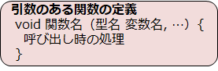
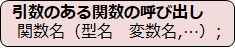
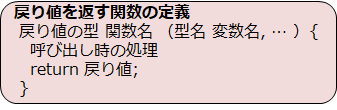
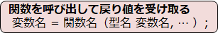
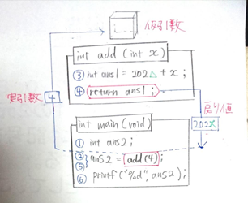

# C言語　第10回　
第10回では、関数の引数と戻り値を学び、関数間で変数のやりとりをできるようになりましょう。
     
  - [引数](#引数)  
      -  [引数の利用例](#引数の利用例)  
  - [戻り値](#戻り値)
      - [return文](#return文)
      - [戻り値の利用例](#戻り値の利用例)
  - [電卓プログラム](#電卓プログラム)

  
## 引数
関数は、呼び出すときに関数の処理に対していくつかの数値や文字、文字列などを与えて実行することができます。  
このように渡せるものを**引数**といいます。

  

関数の定義側では、関数の処理で必要になる値を引数（**仮引数**）で外部から受け取ります。

  

関数の呼び出し側では、関数に渡したい値を引数（**実引数**）に指定してから関数を実行します。

引数は必ず指定しなければいけないものではありません。  
引数を取らないことを明確にしたい場合は、引数に「**void**」とだけ記述します。  
（空にするよりも記述している方が推奨されています）

### 引数の利用例
下のコードは、（実）引数を1つ渡し、4年後と10年後の西暦を出力するプログラムの例です。

``` C
#include <stdio.h>

void add(int x){
   int ans = 2022 + x ;
   printf("%d年後は%d年¥n" x, ans);
}

int main(void){
   add(4);
   add(10);

   return 0;
}

//プロトタイプ宣言を使ったバージョン
/*
#include <stdio.h>

void add(int);

int main(void){
   add(4);
   add(10);

   return 0;
}

void add(int x){
   int ans = 2022 + x ;
   printf("%d年後は%d年¥n" x, ans);
}
*/
```

1. main関数の中で、（実）引数を`4` ,`10`と指定する。
2. （仮）引数として変数`x`を宣言。指定された値が変数に自動的に代入される。
3. 関数内の処理を行う。

下のコードは、（実）引数を2つ渡し、4年後と10年後の西暦を出力するプログラムの例です。

``` C
#include <stdio.h>

void add(int x ,int y){
   int ans = x + y ;
   printf("%d年後は%d年/n", y , ans);
}

int main(void){
   int year = 2022;
   add(year,4);
   add(year, 10);

   return 0;
}

//プロトタイプ宣言を使ったバージョン
/*
#include <stdio.h>

void add(int,int);

int main(void){
   int year = 2022;
   add(year,4);
   add(year, 10);

   return 0;
}

void add(int x ,int y){
   int ans = x + y ;
   printf("%d年後は%d年/n", y , ans);
}
*/
```

1. main関数の中で、（実）引数を`year,4`,`year,10`と指定する。
2. （仮）引数として変数` x,y` を宣言。指定された値が変数に自動的に代入される。
3. 関数内の処理を行う。

## 戻り値
呼び出した関数による処理結果の情報を、呼び出し元に返したいときに使われるのが、**戻り値**です。



関数名の直前にはこれまで`void`を記述していましたが、これは「**戻り値がない関数**」という意味の表明でした。  
ここにデータ型を指定することで、その型の戻り値があることを表すことができます。  
関数定義で値を1つ返すと表明したら、必ず戻り値を返さなければなりません。  



戻り値の受け取り方から、**戻り値は1つしか返せない**ことが分かります。  
return の部分は**return文**と呼ばれますが、当然値は1つしか指定できません。  
この点は非常に重要です。

### return文
return文は多くの場合、関数の処理の一番最後に書かれます。役割は2つあります。  
① 関数の実行を終了する  
② 具体的にどのような値を呼び出し元に返すのかを指定する  

戻り値を持たない型（void型）では、return文は必要ありません。  
あえて書くとすると、`return ;` とだけ書きます。

### 戻り値の利用例
最終的な引数・戻り値の全体の流れは以下の通りです。  

① 「関数名（型名 変数名, … ） 」の（）の中で指定されたものを引数として、関数を実行  
②  実引数→仮引数へ。return文が実行されると関数処理が終了し、呼び出し元へ戻る。  
③  「関数名（型名 変数名, … ） 」の部分が**戻り値に化ける**。その後変数に代入。  

下のコードは、戻り値を利用して、4年後の西暦を出力するプログラムの例です。  

``` C
#include <stdio.h>

int add(int x){
   int ans1 = 2022 + x ;
   return ans1;
}

int main(void){
   int ans2;
   ans2 = add(4);
   printf("%d",ans2);

   return 0;
}


//プロトタイプ宣言を使ったバージョン
/*
#include <stdio.h>

int add(int);

int main(void){
   int ans2;
   ans2 = add(4);
   printf("%d",ans2);

   return 0;
}

int add(int x){
   int ans1 = 2022 + x ;
   return ans1;
}
*/
```

① `4`を引数として`add関数`を実行する。  
② 変数`ans1`に入っている整数値が戻り値である。  
③ `add(4)`が戻り値に化ける。その後`ans2`に代入される。  

プログラムを図で説明したものが以下の通りです。  



①int型の変数`ans2`を宣言  
②実引数を`4`として、`関数add`を実行  
③int型の変数`ans1`に、今年（`202△`）の年数と仮引数の値の和を代入  
④`ans1`の値を戻り値としてmain関数に返す  
⑤`add(4)`が戻り値に化け、`ans2`に代入される  
⑥`ans2`の値を表示  

## 電卓プログラム
これまでの内容を踏まえて、以下の条件を満たすプログラムを作ってみましょう。    

第9回目で作ったプログラム（[電卓プログラム例](https://github.com/kiryu-3/prosa/blob/main/C/pc_1_09/pc_code_09_1.md)）を、引数と戻り値を使用して書き直してみましょう。  
・ユーザーが入力する処理を関数で表す  
・演算子を選択する処理を関数で表す  （[配列の回](https://github.com/kiryu-3/prosa/blob/main/C/pc_1_07/pc_07.md)を参考にしてください）  
・四則演算の処理を関数で表す  

[電卓プログラム例](pc_code_10_1.md)

-----------------------------------
  第10回の補足資料です。  
 変数の書く場所についてです。知らないと後々困ることになるかもしれません。  
  [第10回補足資料](pc_10+.md) 
