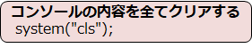

# C言語　第11回補足
オセロプログラムを書くために必要な文法事項について学びましょう。
     
  - [system("cls")](#system("cls"))   

## system("cls")
**system関数**と**clsコマンド**を利用することで、元々表示していた内容を全てクリアすることができます。



・プログラムの先頭に `#include <stdlib.h>` が必要

下のコードは、`system("cls");`の効果を実感できるプログラムの例です。

``` C
#include <stdio.h>
#include <stdlib.h>

int main(void){
  char ret;

  for(int i=0; i<10; i++){
    printf("%d\n", i);
  }
  //コンソールの表示内容をクリアする
  system("cls");
  printf("10\n");
}
```

このプログラムの実行結果は次の通りになります。

``` C
10
```

最初に`0～9`を出力する処理がありますが、**`system("cls");`** によってコンソールの内容がクリアされた際に消されてしまいます。  
そのため、**`system("cls");`** の後に出力した`10`のみが表示されます。
