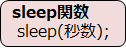

# C言語　第12回補足
オセロプログラムを書くために必要な文法事項について学びましょう。
     
  -  [sleep関数](#sleep関数)   
---
##sleep関数
指定した時間だけ処理を止める手段として**sleep関数**というものがあります。



・プログラムの先頭に `#include <unistd.h>` が必要
・引数は**整数**（小数は指定不可）

下のコードは、`system("cls");`の効果を実感できるプログラムの例です。

``` C
#include <stdio.h>
#include <unistd.h>
 
int main(void) {
    int second = 5;
 
    printf("%d秒間止まります。\n", second);
 
    sleep(second);
 
    printf("%d秒間止まりました。\n", second);
 
    return 0;
}
```

このプログラムの実行結果は次の通りになります。

``` C
5秒間止まります。
5秒間止まりました。
```

このように、`sleep関数`を使って、指定した時間だけ処理を止めることができました。