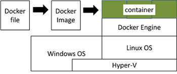

# Docker
Dockerについてざっとまとめてみます。

- [Docker](#docker)
  - [Dockerとは](#dockerとは)
  - [Linuxコマンド](#linuxコマンド)
    - [ディレクトリ](#ディレクトリ)
      - [pwdコマンド](#pwdコマンド)
      - [cdコマンド](#cdコマンド)
      - [lsコマンド](#lsコマンド)
      - [mkdirコマンド](#mkdirコマンド)
      - [touchコマンド](#touchコマンド)
      - [rmコマンド](#rmコマンド)
  - [Docker環境構築](#docker環境構築)
    - [Docker Hub](#docker-hub)
    - [Docker環境構築（Windows編）](#docker環境構築windows編)
    - [Docker環境構築（Mac編）](#docker環境構築mac編)
    - [インストールの確認](#インストールの確認)
  - [更新情報](#更新情報)

## Dockerとは
Dockerとは何か？ [こちら ](https://datawokagaku.com/whatisdocker/)を参考にしてください。  
私の言葉で簡単に述べると、データやプログラムを完全に隔離することで、ファイルの混在や書き換えを防ぐものがDockerでしょうか。

簡単に図に表してみました。  

 　　　　　

・**Container** … 仮想的なユーザー空間のこと。OSやソフトのデータやプログラムが入っている。  
　　　　　　　コンテナを使える仕組みが**Docker**である。  
　　　　　　　持ち運ぶことができるので、OSが違う人同士でも開発環境を一斉に揃えることができる。  
・**Docker Engine** … Dockerを使うためのソフトウェア。  
・**Docker Image** … Containerの素になるもの。1つあれば同じcontainerを量産できる。  
　　　　　　　　 また、containerから Imageを作ることもできる。  
・**Docker file** … Docker Imageを作るための設計書。txtファイル。  
・**Linux OS** … サーバ用のOSの代表格。DockerはLinux OS上でしか動かない。  
・**Windows or Mac** … デスクトップ版のDockerを使用する際は、Linux OSの存在を意識しなくてもよい。  
　　　　　　　　　　そのため、OSが2つ同居することに問題はない。  
　　　　　　　　　　使用する仮想化ソフトウェアはWindowsかMacかによって異なる。  

※1　**サーバ** … 何かサービスを提供するもの。複数の人がアクセスして使う。  
　　　　　　　サーバの機能はソフトウェアで提供される。  
※2　**OS** … ソフトウェアなどプログラムの命令をハードウェアに伝える役割を担うもの。

これらの単語はのちのち解説があると思います。

## Linuxコマンド
Dockerを使う上でLinuxが不可欠であることは前項から理解できたのではないでしょうか。  
Linuxのコマンドをここでは覚えていきましょう。

実行環境ですが、ひとまずWindowsの方は [こちら ](https://zenn.dev/longbridge/articles/5d11bd51665dac)のサイトを参考にLinuxコマンドを使えるようにしてください。  
私自身はGit Bash上でコマンドを入力しています。  
Macの方は標準ターミナルかiTerm2というアプリ上でコマンドを打てるのではないでしょうか。  
（すいません、Macのことはよく分からないので…）

### ディレクトリ
・**カレントディレクトリ** … 今作業しているディレクトリ。
・**ルートディレクトリ** … ディスクの一番上の階層のディレクトリ。  
・**ホームディレクトリ** … ユーザが自由に使えるディレクトリ。  
（おそらく）デフォルトでは、下のディレクトリがホームディレクトリに当たると思います。

今回は以下のディレクトリ構造として説明します。    

#### pwdコマンド
pwdコマンドで: 今いるディレクトリを表⽰します。  

「**/**」で階層が下がっていきます。

#### cdコマンド

現在はホームディレクトリがカレントディレクトリだと思うので、testフォルダに移動してみましょう。

ホームディレクトリへは以下のようにして戻ります。  

これまでは**相対パス**（現在いるディレクトリからみてどこにファイルが存在しているのかを表す表記方法）で移動していました。  

しかし、現在作業中のディレクトリに関係なく、ルートディレクトリから見た位置で表す表記方法を**絶対パス**といいます。  
指定するときは「**/**」から始めます。

絶対パスで移動することで、以下のようにしてルートディレクトリへ移動できます。  
慣れるまでは個々では作業しない方がよいようです。

一つ上の階層を表すのはピリオド二つ「**..**」です。

以下のコマンドで、2つ上の階層へ移動できます。  

現在の階層を表すのはピリオド一つ「**.**」です。  
相対パスで移動し、testフォルダに戻りましょう。

#### lsコマンド
カレントディレクトリのファイル・フォルダの一覧を表示できます。

testフォルダにテキトーなファイルがあることが確認できました。

#### mkdirコマンド
新しいフォルダを作成することができます。  

testフォルダ直下にtekitoフォルダを作ってみましょう。

  

テキトーなファイルに加え、testフォルダ直下にtekitoフォルダが作られました。

#### touchコマンド
新しいファイルを作成することができます。

testフォルダ直下にtekito.txtファイルを作ってみましょう。

testフォルダ直下にtekito.txtファイルが作られました。

#### rmコマンド
ファイルを削除することができます。

testフォルダ直下のtekito.txtファイルを削除してみましょう。  

tekito.txtファイルの削除が確認できました。  

オプションを付けることで、フォルダの削除も行うことができます。  

testフォルダ直下のtekitoフォルダを削除してみましょう。  

テキトーなファイルだけが残されました。

## Docker環境構築
いよいよ、Dockerの環境構築を進めていきましょう。

### Docker Hub
containerのImageは、**Docker Hub**というところから入手することができます。  
よく使われるImageを誰でも簡単に入手することができます。

 [こちら ](https://datawokagaku.com/startdocker/)のサイトを参考に登録してみて下さい。  
 説明がMac前提なので、Verify以降のステップはストップしてください。

### Docker環境構築（Windows編）
Windowsの人は結構面倒なようです。Dockerの環境構築のステップは以下の通りです。  
① wsl2をインストール（[こちら ](https://chigusa-web.com/blog/wsl2-win11/)のサイトを参考にしてください）
② Docker Desktopのインストール（[こちら ](https://bit.ly/3ANnEYX)のサイトを参考にしてください）

なお、Docker DesktopはPCの容量とメモリを著しく消費するようなので注意してください。

### Docker環境構築（Mac編）
Macの方は、先ほどのかめさんのブログ（[こちら ](https://bit.ly/3gAKyfh)）を参考に進んでもらえればよいのではないでしょうか。  
私には詳しいことは分かりませんが、まあWindowsの人よりめちゃ簡単なことはいえます。

### インストールの確認
先ほどまでコマンドを入力していたターミナル上で、以下のコマンドを入力してください。  
Dockerのversionが表示されていたら、Dockerのインストール完了です。

## 更新情報
2022/11/27時点ではここまでとします。  
多分内容の追加はないと思いますが。
