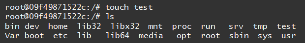

# Docker 　第2章
Docker実行編です。

- [Docker 　第2章](#docker-第2章)
  - [hello-world](#hello-world)
    - [Docker Engineの起動](#docker-engineの起動)
    - [docker login](#docker-login)
    - [docker pull](#docker-pull)
    - [docker images](#docker-images)
    - [docker run](#docker-run)
    - [docker ps](#docker-ps)
  - [ubuntu](#ubuntu)
      - [shell](#shell)
      - [docker run時の注意](#docker-run時の注意)
    - [コンテナの更新](#コンテナの更新)
    - [コンテナ→Image](#コンテナimage)
  - [新しいDocker Imageの配布](#新しいdocker-imageの配布)
  - [更新情報](#更新情報)

## hello-world
では、Dockerhubが持つhello-worldというImagesを利用してcontainerを作っていきましょう。

### Docker Engineの起動
Docker Engineを起動していない状態では、Dockerの作業は何もすることができません。  
Docker Destkopのアイコンを（ダブル）クリックして起動させましょう。

### docker login
Docker HubのImagesを使うため、ターミナル上でDockerにログインします。

Usetnameとパスワードの入力が求められます。先ほどDocker Hubのアカウント作成時に入力したものを入力しましょう。

### docker pull
hello-worldというImageを取り込みましょう。

### docker images
今手元にあるDocker imagesのリストを確認しましょう。

|項目|  内容 |
|:---:| :---: |
|REPOSITORY| イメージ名  |
|TAG| バージョン情報。指定なしだと「latest（最新版）」 |
|IMAGE ID|イメージID。64文字の内、先頭12文字のみの表記。  |
|CREATED|作られてから経過した時間  |
|SIZE | イメージのファイルサイズ  |

### docker run
hello-worldというDocker Imageからコンテナを作成してみましょう。

以下のようなメッセージが表示されたでしょうか。  
hello-worldというコンテナが実行され、その実行結果が得られました。

### docker ps
コンテナの一覧を表示してみましょう。  

オプションを付けずにdocker runをした場合、コンテナはすぐに止まってしまいます。  
オプションについてはいずれ述べますが、今回は存在するコンテナの一覧を表示しましょう。

|項目|  内容 |
|:---:| :---: | :--- |
|CONTAINER ID| コンテナID。64文字の内、先頭12文字のみの表記。  |
|IMAGE| 元となったイメージ名 |
|COMMAND|デフォルトで起動するように構成されているプログラム名。  |
|CREATED|作られてから経過した時間  |
|STATUS | 現在のステータス。動作時：「Up」、静止時：「Exited」  |
|PORTS|割り当てられているポート番号  |
|NAMES | コンテナ名  |

## ubuntu 
コンテナからexitせずにコンテナ内に入ってみましょう。  

今回は**ubuntu**（linuxサーバが派生したOS）というDocker Imageを使います。

以下のような出力結果が得られたでしょうか。  
（初めての場合、色々pullしている様が表示されるかもしれません）

root以下の文字列はコンテナのIDです。  
ここでLinuxコマンドを打つと色々結果が表示されます。

#### shell
コンテナに対してLinuxのコマンドで命令するには、「**shell（シェル）**」と呼ばれる命令をLinuxに命令を伝えるプログラムが必要です。  
だいたいのコンテナには最もポピュラーなshellである「**bash（バッシュ）**」が入っています。  

Ubuntuはbashを受け取ることができるので、今回Imageとして使用しているわけです。  

#### docker run時の注意
実はDockerは、指定されたimageをrunする際にローカルのImageをまずは見に行きます。  
なかった場合にDocker HubにImageを取りに行きます。  

なので、わざわざpullしなくてもrunを実行すれば勝手にpullが行われます。

### コンテナの更新
コンテナ内にファイルを作成してみましょう。

ubuntuコンテナが更新されたことを確認するために、一旦コンテナを出て再度入りなおして確認しましょう。

コンテナを出るために以下のコマンドを実行しましょう。

`docker ps -a`を実行すると、STATUSがExitedになっていることが確認できるはずです。

再度コンテナを起動してみましょう。

`docker ps`を実行すると、STATUSがUpになっていることが確認できるはずです。

（Imageではなく）コンテナを指定してbashを起動しましょう。

テストファイルの存在が確認できました。

### コンテナ→Image
コンテナを新しいDocker Imageとして保存しましょう。

今回はImage名はubuntuのまま、TAGを`**update**`として新しいImageを作りました。

`Docker Images`で新しいImageを確認してみましょう。

## 新しいDocker Imageの配布
Imageを配布するために、Docker Hubにアップロードしてみましょう。

といいたいところですが、以降の流れは [こちら ](https://bit.ly/3gGYcgW)を参考にしてください。

## 更新情報
2022/11/29時点ではここまでとします。  
多分内容の追加はないと思いますが。
