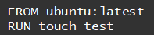
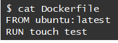
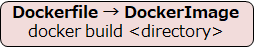
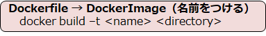
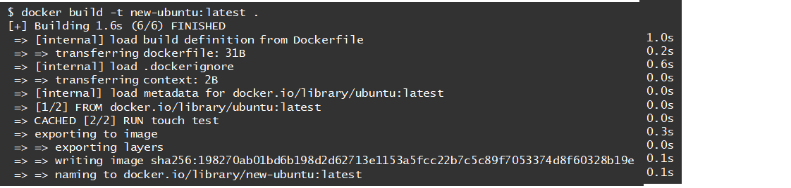
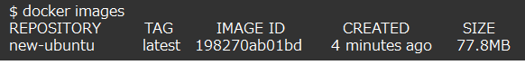
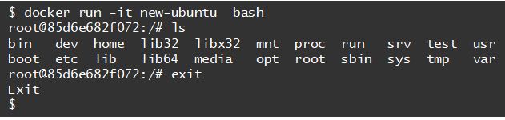

# Docker 　第3章
Dockerfileを作っていきましょう。

- [Docker 　第3章](#docker-第3章)
  - [Dockerfileとは](#dockerfileとは)
  - [Dockerfile作成](#dockerfile作成)
  - [DockerfileからImage作成](#dockerfileからimage作成)
  - [よく使うDockerfileコマンド](#よく使うdockerfileコマンド)
- [更新情報](#更新情報)

## Dockerfileとは
これまでは以下の流れでDockerImageを作ってきました。  
①DockerHubからImageを入手(pull)  
②コンテナの作成(run)  
③コンテナを編集し、新しImageを作成(commit)  

今回は**Dockerfile**というDockerImageの設計図に当たるものを利用してImageを作成します。    
設計図があることで、コンテナの中身がどういうものかすぐに理解できるようになります。

Dockerfile自体はただのテキストファイルですが、  
Dockerfileを元にImageを作るケースが現場では圧倒的に多いようです。  

## Dockerfile作成
みなさんがお気に入りの場所にDockerというフォルダを作成し、そのなかにDockerfileというフ

ァイルを作ってください。  

作ったテキストファイルの中に以下のように記述してください。

**FROM**：元となるベースのイメージを指定    
                　　　　Dockerfileの先頭に書かれることが多い
**RUN**：実行したいLinuxコマンドを指定

今回は、以下のような流れでImageが生成されます。  
①ubuntuというImageをベースする(FROM)  
②testファイルを作るtouchコマンドを実行(RUN)  
③testというファイルが作られた状態でImaegが生成される

※Dockerfileのコマンドは後で一覧にすると思います。

## DockerfileからImage作成

まずはDockerfileの中身をLinuxコマンドで確認しましょう。  
以下のように入力してください。 

Dockerfileが保存されているフォルダ上で以下のコマンドを打つと、DockerImageが作成されます。

では以下のように入力してbuildしていきましょう！

Imageができたかどうか確認してみましょう。

確認できたので、これまでの流れ通りrunしてみましょう。

テストファイルの生成が確認できました。  
まだまだやれることはたくさんあると思いますが、時間がないのでここまでとします。

## よく使うDockerfileコマンド
最後に、ざっとまとめておきます。

|コマンド|  内容 |
|:---:| :---: |
|FROM| 元にするイメージを指定する  |
|COPY(ADD)| イメージにファイルやフォルダを追加する　基本COPY |
|RUN|build時にコマンドを実行する  |
|CMD|run時ではなく、コンテナ起動時にコマンドを実行する  |
|ENTRYPOINT | Image実行時のコマンドを強要する  |
|LABEL | 名前・バージョン番号・製作者情報など  |
|EXPOSE | 指定したポートをコンテナが受け付けるようになる  |
|ENV | 環境変数を定義する  |
|VOLUME|保存場所をイメージの利用者に伝える  |
|USER | コマンドを実行するユーザー・グループを指定　デフォルトはroot  |

## 更新情報
2022/11/30時点ではここまでとします。  
結構追加ありそうです。
