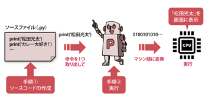

# Python　第0回　
第0回では、Pythonの環境設定を行うとともに、Pythonの基礎知識について学んでいきましょう。  

  - [Pythonとは](#Pythonとは)
  - [開発環境の整備](#開発環境の整備)
  - [Pythonの基礎知識](#Pythonの基礎知識)
    - [開発の流れ](#開発の流れ)
      - [ソースコードの作成](#ソースコードの作成)
      - [実行](#実行)
    - [プログラムの書き方](#プログラムの書き方)
      - [正確に記述する](#正確に記述する)
      - [読みやすいソースコードを記述する](#読みやすいソースコードを記述する)

 
## Pythonとは
**Python**とは、プログラムを作るために利用するプログラミング言語の1つです。  以下のような特徴があります。  
  - 基本文法がシンプルで学びやすい。
  - 簡潔で読みやすいプログラムを書くことができる。
  - 便利な命令が豊富に備わっており、すぐに使い始めることができる。
  - 汎用性が高い。
      - Webアプリ
        -  Django,Flask
      - 機械学習
        -  Scikit-learn,TensorFlow
      - データサイエンス
        -  Matplotlib,Seaborn,Pandas,Numpy
      - Webスクレイピング
        -  Requests,BeautifulSoup
      - FX自動売買
        -  API
      - Excel自動操作
        -  Pandas
      -  ゲーム開発、ブロックチェーン  

（参考→ [Pythonのできること・できないこと](https://markup-media.com/programming/word-python/#Python-3)  ）


## 開発環境の整備
以下のURLを参考に、環境を構築しましょう（以下、これを**VSCode**と呼ぶ）。  

  ＜Windows＞ [Visual Studio CodeでPythonプログラミングを始める（Windows編）](https://bit.ly/3BSqWLR)  
  ＜Mac＞ [VS CodeでPythonを始めよう！【Mac】](https://biotech-univ.com/2021vs-codepythonmac/#toc3)   
（拡張機能についてはWindows編のサイトを参照してください）


Pythonを利用できるツールはたくさん存在します。
つながりを意識してVSCodeでの環境構築を推奨しますが、一応別の方法もあります。

  ＜Windows＞ [Anaconda（Python3）インストール手順＜Windows用＞](https://sukkiri.jp/technologies/ides/anaconda-win_install.html)  
  ＜Mac＞ [Anaconda（Python3）インストール手順＜macOS用＞](https://sukkiri.jp/technologies/ides/anaconda-mac_install.html)     
  ＜共通＞[Google Colabratory](https://blog.kikagaku.co.jp/google-colab-howto)     

2年春には、授業（授業内では[Google Colabratory](https://blog.kikagaku.co.jp/google-colab-howto)  ですが）に合わせて別の環境構築法を提案しようと思います。

## Pythonの基礎知識
以下の内容は、Pythonの基礎知識と基本構造です。  
いますぐ覚える必要は全くありません。ゆっくり覚えていきましょう。
  
### 開発の流れ



#### ソースコードの作成  

最初に、Pythonの文法に基づいてコンピュータへの命令を記述し、人間が読んで意味の分かる状態のプログラムを組みます。  
このプログラムを**ソースコード**（又は単に**ソース**や**コード**）といいます。  
そして、記述したソースコードをファイルとしてコンピュータに保存します。  これを**ソースファイル**といいます。  

＜Pythonのソースファイル名＞   
①ファイルの拡張子は必ず「**～.py**」とする  
②漢字やひらがなを使うとトラブルの原因になる可能性があるため、**半角の英数字**を使うことが望ましい

#### 実行
コンピュータの心臓部であるCPUは、**マシン語**と呼ばれる言語で書かれたプログラムしか実行できません。  
そのため、ソースファイルとして保存しただけでは、プログラムを動作させることができません。  

そこで開発者は、**Pythonインタプリタ**と呼ばれるソフトウェアを用いて、ソースファイルの内容をマシン語のプログラムに変換します。  
実際の変換の過程は以下の通りです。  

①Pythonインタプリタがソースコードの文法チェックを行う   
②誤記があれば**構文エラー**(**SyntaxError** )を表示して変換中止
③ソースコードに書かれている命令を1つずつマシン語に変換しながら実行
④実行時に起きたエラーを**例外**(**Exception**)と呼ぶ。
　例外が起きたらその内容を表示して実行をストップする。

#####＜エディタ＞
**エディタ**とは、プログラムを入力するためのソフトです。VSCodeが当たります。
シンプルなかわりに、必要なプラグインを探してインストールすることは自分ですることになります。
ちょっとした編集にはエディタが便利とされています。VSCodeに限り非常に完成度が高く高機能であることから、この後紹介するIDEとの境目がなくなってきていると言われます。

#####＜IDE＞
**IDE**（**統合開発環境**）とは、開発に必要なエディタやインタプリタ、プログラムのバグを検出するデバッガなどの  
多種多様なツール群を1つの画面でできるようにしたソフトウェアです。[JupyterLab](https://sukkiri.jp/technologies/ides/anaconda)や[Google Colabratory](https://blog.kikagaku.co.jp/google-colab-howto) が当たります。  
開発作業においてよく使う機能が最初からひとまとめにされており、 大抵の作業はIDEの中で完結するようになっています。

[Anaconda](https://sukkiri.jp/technologies/ides/anaconda)はPythonプログラム開発のための便利な環境を提供してくれるソフトウェアです。  
Anacondaをインストールすると、開発に不可欠なPythonインタプリタや、JupyterLabのような統合開発環境、外部ライブラリがまとめてインストールされます。  

[JupyterLab](https://sukkiri.jp/technologies/ides/anaconda)や[Google Colabratory](https://blog.kikagaku.co.jp/google-colab-howto) を使用する際には、注意点があります。
それは、作成したファイルは**ノートブック**(**～.ipynb**)という形式になることです。
そのため、ノートブックを直接Pythonインタプリタで変換して実行することはできません。

### プログラムの書き方

#### 正確に記述する

間違った文字を入力するとプログラムは正常に動きません。以下の点に注意しましょう。

①英数字は基本的に半角で入力し、大文字/小文字の違いも意識する  
②「**;**」(**セミコロン**)と「**:**」(**コロン**)、「**.**」（**ピリオド**）と「**,**」（**カンマ**）を正確に入力する  
③「**()**」、「**{}**」、「**[]**」などのカッコや、「**'**」と「**"**」の引用符の種類を間違えないようにし、また必ず閉じる。

例えば、次のように記述するとエラーになります。
``` python
print('Hello,World')  #正しい
Print('Hello,World')  #Pが大文字
print('Hello,World'}  #波カッコになっている
print('Hello,World)   #引用符を閉じていない
```

#### 読みやすいソースコードを記述する

誰が見ても分かりやすいソースコードを記述することは、今後も必要です。  
**コメント**を活用することで、読みやすいコードになります。  

##### ○コメント
プログラムをより読みやすくするため、ソースコードの中に解説文を書き加えることができます。  
この解説文を**コメント**といい、動作には全く影響しません。


