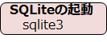
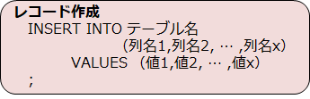
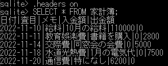

# SQL
SQLについてざっとまとめてみます。

  - [SQLとは](#SQLとは)
    - [テーブル](#[テーブル)
    - [データベース管理システム](#データベース管理システム)
- [SQL](#sql)
  - [SQLとは](#sqlとは)
    - [テーブル](#テーブル)
    - [データベース管理システム](#データベース管理システム)
  - [開発環境の整備](#開発環境の整備)
  - [sqlite3の基本的な使い方](#sqlite3の基本的な使い方)
  - [テーブル作成](#テーブル作成)
  - [レコード作成](#レコード作成)
  - [データの検索](#データの検索)
  - [レコード更新](#レコード更新)
  - [レコード削除](#レコード削除)
  - [更新情報](#更新情報)

## SQLとは
  検索や書き換え、分析などのデータ管理を目的として蓄積された、様々な情報そのものを**データベース**といいます。
  とくにITの世界では、電子的な媒体にファイルなどの形式で保存したものをいいます。

  一番オーソドックスなデータベースは、複数の表の形式でデータを管理する**リレーショナルデータベース**(**RDB**)です。
  この表に書かれたデータを取り出したり書き換えたりするために、**SQL**という専用言語が必要になります。

### テーブル
RDBに入っている個々の表を**テーブル**といいます。    

テーブルは**行**(row,**レコード**ともいう)と**列**(columns)で構成されています。  
1行が1件のデータに対応し、列はそのデータの要素に対応します。

また、一つ一つのマスのことを**セル**といいます。

### データベース管理システム
データベースの中のデータを操作するには、データベースファイルではなく、**データベース管理システム**（**DBMS**）と呼ばれるプログラムに**SQL文**を送信します。
ここでは**SQLite**というDBMSを使っていくものとします。

## 開発環境の整備
  Macの方はすでにインストールされているはずです。ターミナルに`sqlite3`と入力してバージョンが表示されることを確認してください。
  Windowsの方など、インストールが必要な場合は [こちら ](https://www.sqlite.org/download.html)からダウンロードを進めてください。
  (Windowsの方は「sqlite-tools-win32-x86-3400000.zip」と書かれているものだと思います)
  その後の流れは私は [こちら ](https://self-development.info/windows%E3%81%AB%E6%9C%80%E6%96%B0%E7%89%88sqlite%E3%82%92%E3%82%A4%E3%83%B3%E3%82%B9%E3%83%88%E3%83%BC%E3%83%AB%E3%81%99%E3%82%8B/)のサイトを参考にしました。

## sqlite3の基本的な使い方
まずは、作業をしたいディレクトリに移動しましょう。  
その後以下のコマンドを入力してsqliteを起動してください。  

次にデータベースの作成を行います。拡張子は通常**db**(**sqlite3**のときもある)を用います。  

<dbfile>というデータベースが作成されました。私は`mydb.db`というデータベースを作成しました。

## テーブル作成

次にテーブルを作成します。**CREATE TABLE文**を使います。

データ型は以下の表を参考にしてください。

|データ型| 意味 |
|:---:| :---: |
|NULL| 空  |
|INTEGER| 整数 |
|REAL| 小数 |
|TEXT | 文字列  |

それぞれのカラムにルールを設けることができます。
これを**constraint**といいます。データをきれいに保持することができます。

|constraint| 意味 |
|:---:| :---: |
|NOT NULL| NULLを入れさせない  |
|DEFAULT| デフォルト値を設定 |
|UNIQUE| 重複を許さない |
|PRIMARY KEY | IDとなるカラム  |
|CHECK | ルールを設定  |
  

  以下のように入力して家計簿テーブルを作ってみましょう。

  テーブル作成後はテーブルの定義を確認しましょう。

  

  `.schema`を入力して、以下のようなテーブルが表示されることを確認してください。

## レコード作成
次に**INSERT文**を使って、テーブルに新しいデータを追加しましょう。

以下のように入力して家計簿テーブルにレコードを追加してみましょう。

## データの検索
次に**SELECT文**を使って、家計簿テーブルを表示してみましょう。

全てのカラム情報を取得する際は`SELECT * FROM ＜テーブル名＞;`とします。
また、`headers on`とするとヘッダーを表示できます。

並び替えなど多くの付属機能がありますが、ここでは省略します。

以下のように入力して家計簿テーブルを表示してみましょう。

## 　レコード更新

次に**UPDATE文**を使って、特定のレコードのカラムの値を更新してみましょう。

以下のように入力して家計簿テーブルを更新してみましょう。

## レコード削除

次に**UPDATE文**を使って、特定のレコードを削除してみましょう。

以下のように入力して家計簿テーブルを更新してみましょう。

## 更新情報
疲れたので2022/11/20時点ではここまでです。
